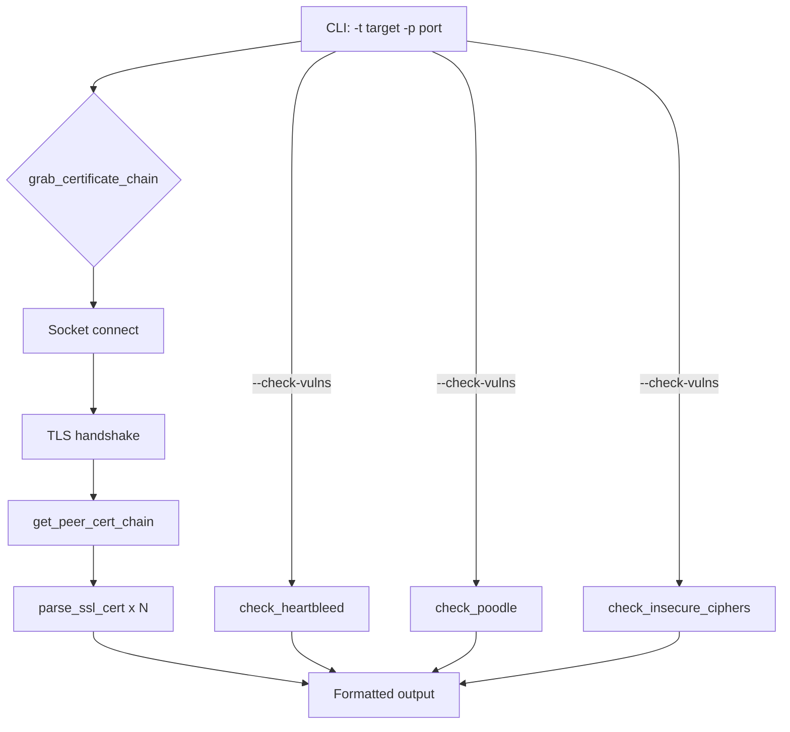
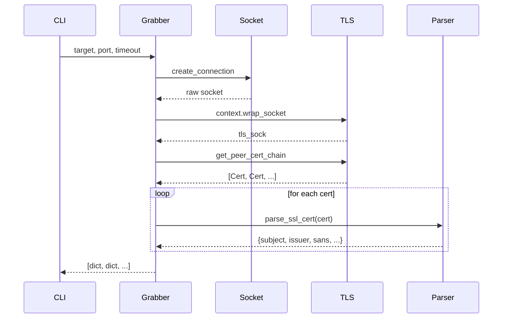

# CertGrab


**TLS/SSL certificate grabber and vulnerability checker** — network engineer
style. Connects to any TLS-enabled service, retrieves the full certificate
chain, parses X.509 fields, and optionally checks for Heartbleed, POODLE,
and insecure cipher suites.

## Features

- 🔍 **Full chain grab** — retrieves and parses every cert in the chain
- 📋 **Rich output** — subject, issuer, SANs, validity, fingerprints, key type
- 🛡️ **Vulnerability scanning** — Heartbleed (CVE-2014-0160), POODLE (CVE-2014-3566), weak ciphers
- ⚡ **Zero external deps** — uses Python 3.14+ `ssl.Certificate` API
- 🧪 **All tests mocked** — safe to run anywhere, no real hosts contacted

## Quick Start

```bash
# Grab certificate from a host
python3 certgrab.py -t example.com

# Custom port
python3 certgrab.py -t example.com -p 8443

# Run vulnerability checks
python3 certgrab.py -t example.com --check-vulns

# Increase timeout for slow connections
python3 certgrab.py -t 10.0.0.1 -p 443 --check-vulns --timeout 15
```

## Usage

```text
usage: certgrab.py [-h] -t TARGET [-p PORT] [--check-vulns] [--timeout TIMEOUT] [--version]

CertGrab v1.0 — TLS/SSL certificate grabber and vulnerability checker

options:
  -h, --help        show this help message and exit
  -t, --target      Target hostname or IP address
  -p, --port        Target port (default: 443)
  --check-vulns     Check Heartbleed, POODLE, weak ciphers
  --timeout         Connection timeout in seconds (default: 10)
  --version         show program's version and exit
```

## Architecture



### Certificate Parsing Flow



## Vulnerability Checks

| Check | CVE | Method |
|-------|-----|--------|
| Heartbleed | 2014-0160 | Sends oversized TLS heartbeat; checks response size |
| POODLE | 2014-3566 | Attempts SSLv3 connection; success = vulnerable |
| Weak ciphers | Various | Negotiates with weak cipher list; checks negotiated cipher |

## Testing

```bash
python3 -m pytest tests/ -v
```

All tests use mocked network calls — no real hosts are contacted.

## License

MIT © 2026 S8C88
